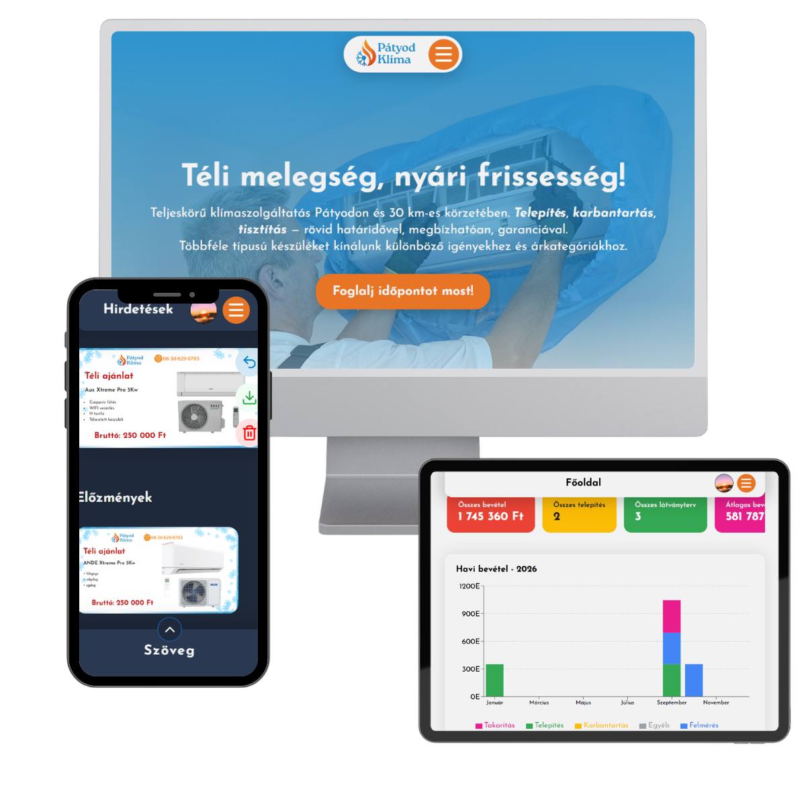

    

<h1 align="center">Pátyod Klíma Admin Portal</h1>

    A dynamic, full-stack CMS and business management system for a HVAC installation company.

---

## 📋 About

Developing a dynamic web application to replace the previous static site. The goal is to create a **CMS and business management system** that allows the client to independently:

- Manage advertisements
- Upload and manage reference images
- Track client installations and jobs
- Generate AI-powered visual AC unit placements

My primary goal with this was to reinforce my fundamental knowledge of web development and to master new technologies — covering full-stack development, clean architecture, testing practices, and modern tooling from the ground up.

    

---

## ✨ Features

### Client-Side Website
- Responsive, SEO-optimized public website
- Reference image gallery
- Privacy policy and cookie management

### Admin / CMS
- 📊 Custom dashboard (revenue, client & job statistics, interactive charts)
- 👤 Client management
- 🧰 Job & installation tracking
- 🖼️ Reference gallery CMS
- 🤖 AI-powered visual design tool — generates photorealistic indoor / outdoor AC units on real customer photos
- 📢 Ad generator & downloader with pre-made templates and brand-specific device catalogs
- 🔐 Secure, password-based admin login

---

## 🛠️ Tech Stack

### Designing and Styling

- **Figma** for for UI/UX designing and prototyping
- **dbdiagram.io** for visualize DBML schemas
- **Google Fonts** for typography
- **Unsplash / Pexels** for stock photos

### Frontend

- **React** (Vite)
- Vanilla **CSS**

### Backend

- **Node.js**
- **Express**
- **Prisma ORM**
- **PostgreSQL** via **Supabase**

### Testing

- **Vitest** and **React Testing Library** for frontend unit testing
- **Jest** for backend unit testing
- **Chrome DevTools** for responsive testing and debugging
- **Postman** for API endpoint testing

### Tools

- **VS Code** is my primary code editor
- **Jira** for agile task management
- **Claude / Gemini** for code optimization and learning
- **Notion** for documentation and note-taking
- **Git & Github** for source control and PR handling
- **CodeRabbit** for PR reviews
- **Google Analytics** for tracks and reports website's traffic
- **Render** for deploying the backend and frontend
- **UptimeRobot** for monitoring the availability, performance, and status of the website
- **Cloudflare AI** for the image inpainting to generate realistic indoor and outdoor HVAC unit placement on photos

### Package Manager & Dependencies

**npm** package manager

<strong>Backend dependencies</strong>

- **Supabase JS** — file storage management
- **Multer** — handling and processing incoming file uploads
- **Sharp** — image processing, resizing, and WebP optimization
- **CORS** — enabling secure cross-origin requests between frontend and backend
- **pg** — PostgreSQL client for the database connection
- **dotenv** — secure environment variable and configuration management
- **bcryptjs** — secure password hashing and verification
- **express-rate-limit** — prevents brute-force login attacks

<strong>Frontend dependencies</strong>

- **React Hot Toast** — user feedback notifications
- **Framer Motion** — website animations
- **Lucide React** — customizable SVG icons
- **Swiper** — touch-friendly sliders
- **React Helmet Async** — managing document head metadata dynamically for better SEO
- **React-Snap** — pre-rendering of the app to improve load times and SEO rankings
- **ESLint** — maintaining code quality and catching syntax errors
- **Prop-types** — runtime type checking of component props
- **Lottie React** — animated components
- **React-Select** — custom dropdowns

## 🚧 Roadmap

- 📊 Custom dashboard ✅
- 👤 Client management ✅
- 🧰 Job/installation tracking ✅
- 🖼️ Reference image management ✅
- 🤖 AI visual design tool ✅
- 📢 Ad creation & downloading ✅

---

<h3 align="center">👨‍💻 Developer</h3>

Designed and Developed by Daróczi Levente
